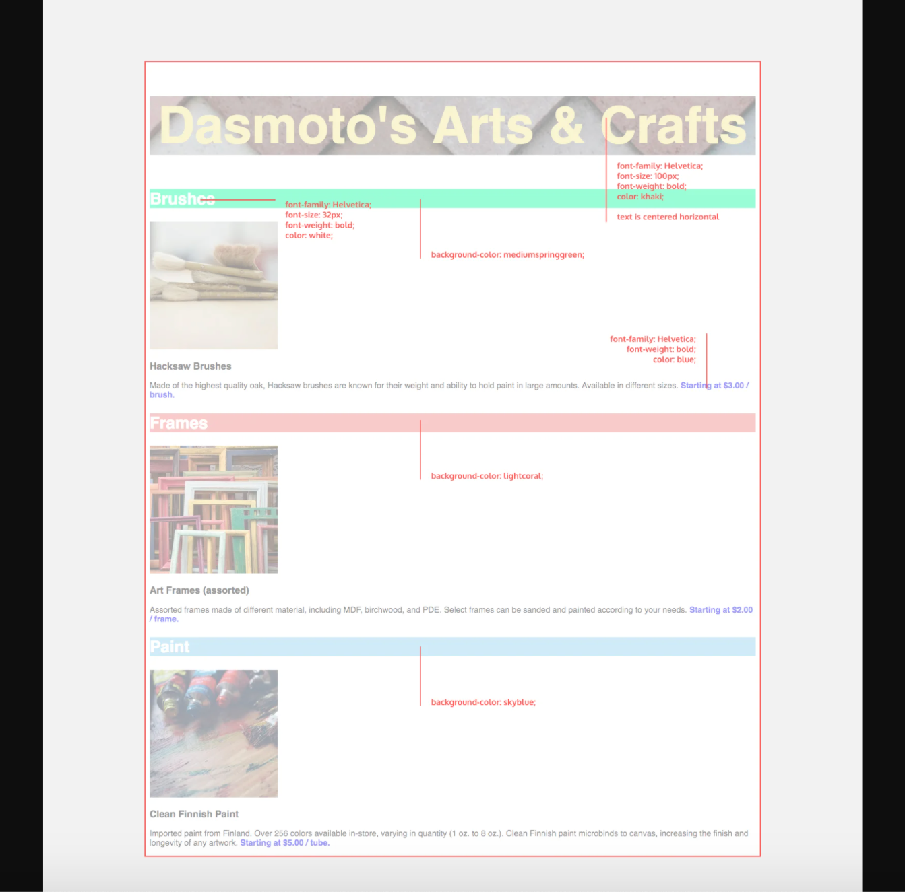
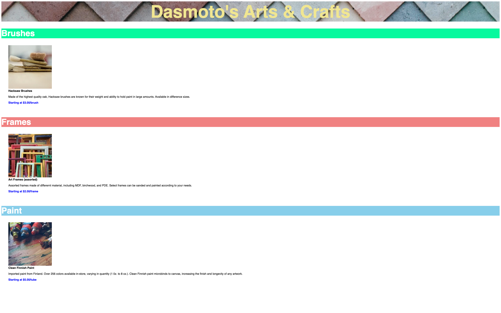

# Dasmoto's Arts & Crafts

"Dasmoto's Arts & Crafts" is a simple website for a fictional arts & crafts with a few products.

## Technologies

<ul>
    <li>HTML</li>
    <li>CSS</li>
    <li>Git</li>
</ul>

## Installation

<ol>
    <li>Install <strong>VS Code</strong></li>
    <li>Download from this repository and store in local file of choosing</li>
    <li>Open in VS Code</li>
</ol>

## Visuals

Design spec: 

Final Product: 

## Purpose and Future Edits

This project was presented as a challenge by <a href="codeacademy.com">Codeacademy</a>.

The following materials were given:

<ul>
    <li>4 images</li>
    <li>Design spec for final product</li>
</ul>

The requirements were to make the final product look as similar to the Design Spec as possible and to use the 4 images provided. How the site is structured and what elements I used were entirely up to me.

I believe this project will receive one final edit to align the descriptive text to the actual images used in the body of the website.

Simple and quick project with limited guidance - great for a beginner web developer!

## Acknowledgement

<strong>CodeAcademy</strong> - thank you for providing consistent challenges as users learn!
